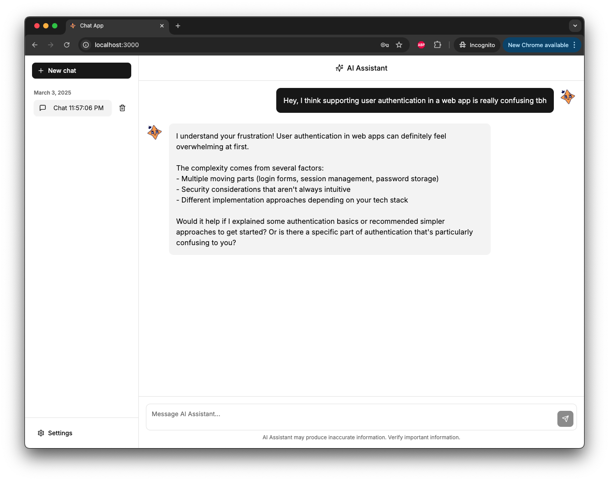
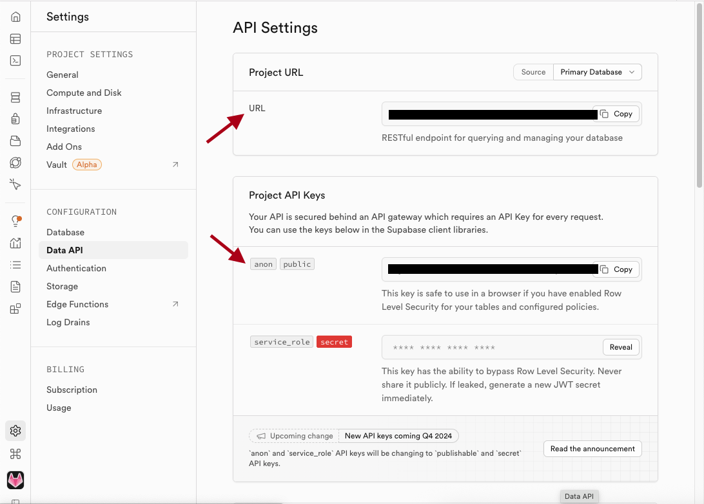
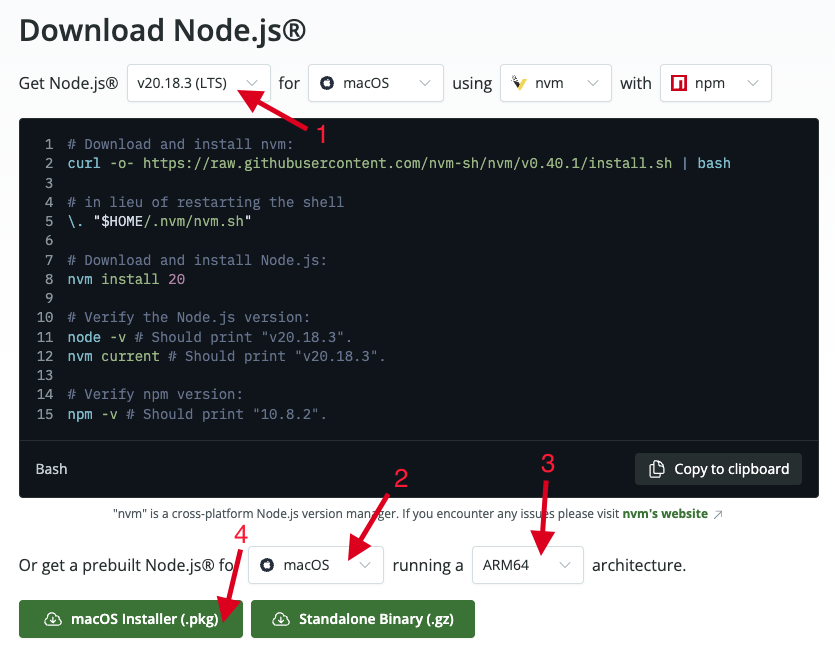

# 🤖 WiCS Workshop 2025 - ChatGPT Clone

A modern AI chat application built with **Next.js v14**, integrating Anthropic's AI capabilities and Supabase for data storage and authentication.




## 📖 Table of Contents

- [✨ Prerequisites](#-prerequisites)
- [🚀 Getting Started](#-getting-started)
- [📁 Project Structure](#-project-structure)
- [📍 API Endpoints](#-api-endpoints)
- [➕ Adding New Functionality](#-adding-new-functionality)
- [✈️ Deploying to Vercel](#-deploying-to-vercel)
- [🌀 Deploying to a custom domain](#-deploying-to-a-custom-domain)
- [📝 License](#-license)

## ✨ Prerequisites

This workshop assumes that you are somewhat familiar with **git**, React, JavaScript, HTML, CSS, and using terminal commands.

You will also need to get:

1. **Supabase Account & Project** (free)

   - Sign up at [Supabase](https://supabase.com)
   - Create a new project

2. **Anthropic API Key** (paid - you won't be able to receive AI responses without this)

   - Sign up at [Anthropic Console](https://console.anthropic.com)

3. **Vercel Account** (free - only required if you want to deploy the app)

   - Sign up at [Vercel](https://vercel.com)

4. **Namecheap Account** (free - only required if you want a custom domain)

   - Sign up for the [GitHub Student Developer Pack](https://education.github.com/pack) to get a free `.me` domain
   - Sign up for a [Namecheap](https://namecheap.com) account



## 🚀 Getting Started

**Database setup:**

1. Go to **Supabase > SQL Editor** and paste the contents of `setup.sql` into the query editor. Run the query. Verify that it says "Success. No rows returned".
2. Disable email verification (**important!**) by going to **Supabase > Authentication > Sign In / Up > Email >** and disable the **"Confirm email"** toggle, and click Save.

**Option 1: Run the project locally** (fastest and best development experience)

1. Download and run the [Node.js v20.18.3 (LTS)](https://nodejs.org/en/download) installer (see image below). Your OS and architecture should be detected automatically by the page.
2. Install `pnpm` by running `npm install -g pnpm` in your terminal. **Verify** that running `node -v` and `pnpm -v` returns version numbers.
3. Clone this repository.
4. Copy the `.env.example` file to a new file called `.env` and fill in your environment variables from Supabase and Anthropic.
5. Run `pnpm install` to install the dependencies
6. Run `pnpm run dev` to start the development server



**Option 2: Run the project with Docker** (if you can't make Option 1 work)

1. Clone this repository.
2. Copy the `.env.example` file to a new file called `.env` and fill in your environment variables from Supabase and Anthropic.
3. Download and install [Docker Desktop](https://www.docker.com/products/docker-desktop/)
4. Make sure it also installed [Docker Compose](https://docs.docker.com/compose/install/)
5. In your terminal, run `docker-compose up` and wait for the containers to start. If you get an error that says `Is the docker daemon running?`, open the Docker Desktop app manually and try again.
6. Open [http://localhost:3000](http://localhost:3000) with your browser to see the result.
7. If you need to run more terminal commands, open a new terminal, get your container ID by running `docker ps`, and then run `docker exec -it <container_id> bash` to get a bash shell.

**Option 3: Run the project in an online IDE** (pages will load very slowly)

1. Create a public fork of this repository.
2. Go to [Repl.it](https://replit.com).
3. Create a new Replit project by importing your public fork of this repository.
4. Set the run command to `pnpm run dev` and click _Confirm_.
5. Copy the `.env.example` file to a new file called `.env` and fill in your environment variables from Supabase and Anthropic.
6. Click the green "Run" button.

## 📁 Project Structure

The project uses Next.js 14 App Router with client-side and server-side authentication.

```bash
chatgptnextjs/
├── app/
│   ├── api/           # API route handlers
│   │   ├── chat/      # AI chat endpoints
│   │   └── conversations/ # Conversation management
│   ├── auth/          # Authentication pages
│   ├── settings/      # Settings page
│   ├── layout.tsx     # Root layout with auth and theme
│   └── page.tsx       # Main chat interface
├── components/
│   ├── auth/         # Authentication page components
│   ├── ui/           # Reusable UI components
│   ├── chat-area.tsx # Main chat interface
│   └── chat-sidebar.tsx # Conversation sidebar
├── lib/              # Shared utilities
│   └── supabase.ts   # Supabase client and types
├── public/           # Static assets like images
└── types/            # TypeScript type definitions
```

### 📍 API Endpoints

All endpoints require Supabase server-side authentication and return appropriate [HTTP status codes](https://developer.mozilla.org/en-US/docs/Web/HTTP/Status) on errors.

- `POST /api/chat` makes a request to Anthropic's API to generate a response in a "streamed" format.

- `GET /api/conversations` lists all conversations that exist in the database for the current user, sorted by newest first.

- `POST /api/conversations` creates a new conversation in the database for the current user.

- `DELETE /api/conversations/[id]` deletes a specific conversation from the database.

- `GET /api/conversations/[id]/messages` gets all messages from the database for a specific conversation.

- `POST /api/conversations/[id]/messages` creates a new message in the database for a specific conversation.

### ➕ Adding New Functionality

Some ways you can add new functionality to this app:

1. **New page:** Check out http://localhost:3000/about for an example of how to add a new page to this app.
2. **New API endpoint:** Create a new API endpoint by following the same patterns as the existing `route.ts` files in `app/api/`. For example, if you create a new GET endpoint in `app/api/greeting/morning/route.ts`, you can access it with `fetch('/api/greeting/morning')`.
3. **Small UI elements** like buttons, checkboxes, etc. are added using the **shadcn** library. All you have to do is run `pnpm dlx shadcn@latest add <component-name>`, a list of all existing **shadcn** components can be found [here](https://ui.shadcn.com/docs/components/accordion).
4. **Large, custom UI components** like entire forms or pages are added in `components/` and then imported in a `page.tsx` or other component file. For example, look at `app/components/chat-sidebar.tsx`.

## ✈️ Deploying to Vercel

**Option 1: Terminal** (if you have `pnpm` and `Node.js` installed locally)

1. Install [Vercel CLI](https://vercel.com/docs/cli):
   ```bash
   pnpm install -g vercel
   ```
2. Run `vercel` and follow the instructions to deploy the application
3. (If not automatic) Go to Vercel Dashboard, paste your `.env` in the Project Settings, then re-deploy

**Option 2: Vercel Dashboard**

1. Go to Vercel Dashboard and create a new project from your forked repository
2. Go to Project Settings and paste your `.env` in the Environment Variables section

## 🌀 Deploying to a custom domain

You can get a free `.me` domain through **Namecheap** with the [GitHub Student Developer Pack](https://education.github.com/pack). Once you have "purchased" the domain:

1. Go to Vercel Dashboard (see previous section)
2. Click on your project > Domains > Add Domain > Add
3. Follow the instructions on the Vercel page to configure your `A` record and `CNAME` record on Namecheap

## 📝 License

This project is licensed under the MIT License - see the LICENSE file for details.
