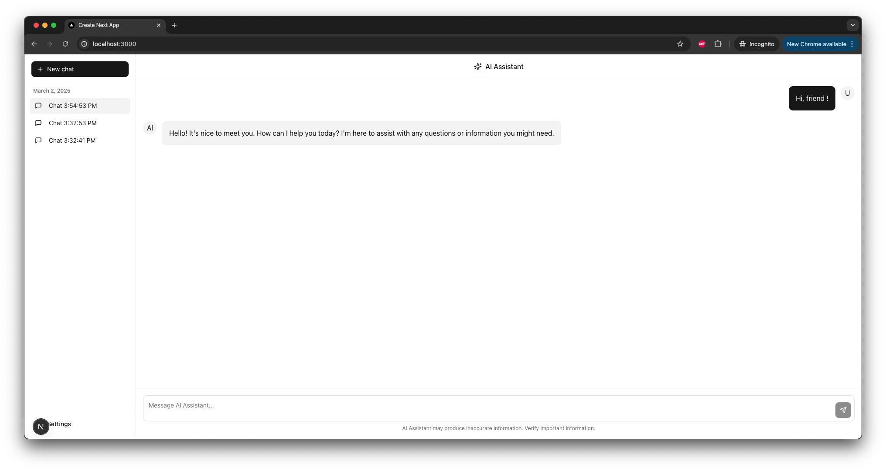

# 🤖 ChatGPT Next.js Application

A modern chat application built with Next.js, integrating Anthropic's AI capabilities and Supabase for data storage.




## ✨ Prerequisites

Before you begin, ensure you have the following installed:

- Node.js (v18 or higher)
- pnpm package manager (`npm install -g pnpm`)
- A Supabase account and new empty project
- An Anthropic API key (may require credit card information)

## 🚀 Getting Started

You can do everything below in your local machine, in [Github Codespaces](https://github.com/codespaces) or in [Replit](https://replit.com).

1. Clone (or fork) the repository

2. Install dependencies with `pnpm install`

3. Copy the `.env.example` file to a new `.env` file.

4. Get your Anthropic API key from the [Anthropic Console Dashboard](https://console.anthropic.com/dashboard)

5. Get your Supabase `URL` and `anon public` key (**not** `service_role secret` key) by going to your Supabase Dashboard -> Project -> Project Settings -> Data API.

6. Paste those values in your `.env` file. Make sure the values start and end with double quotes `"`.

7. Go to your Supabase Dashboard -> SQL Editor, paste the contents of the `setup.sql` file, and click "Run".

8. Go to your terminal and run `pnpm run dev`.

9. Open [http://localhost:3000](http://localhost:3000) with your browser to see the result.

## 🛠️ Tech Stack

- [Next.js](https://nextjs.org/) - React framework
- [Anthropic AI SDK](https://www.anthropic.com/) - AI integration
- [Supabase](https://supabase.com/) - Backend and database
- [Tailwind CSS](https://tailwindcss.com/) - Styling
- [TypeScript](https://www.typescriptlang.org/) - Type safety
- [Radix UI](https://www.radix-ui.com/) - UI components

## 📁 Project Structure

```bash
chatgptnextjs/
├── src/
│   ├── app/          # Next.js app directory - must be named app
│   ├── components/   # React components (button, chat-sidebar, etc.)
│   ├── lib/          # Utility functions (Supabase client, etc.)
│   ├── types/        # TypeScript types and interfaces
├── public/           # Static files like images, icons, etc.
├── setup.sql        # Database setup commands
└── ...              # Configuration files
```

## 🗺️ App Router Structure

The project uses Next.js 13+ App Router, which follows a file-system based routing approach. Here's the current structure and guidelines for expansion:

```bash
src/app/
├── layout.tsx           # Root layout - shared UI and providers across the app
├── page.tsx             # Home page (/) - landing page
├── api/                 # API route handlers
│   ├── chat/            # Chat-related endpoints
│   │   └── route.ts        # Main chat API endpoint
│   └── conversations/   # Conversation-related endpoints
│       └── route.ts        # Conversation CRUD operations
```

Further routes and pages can be added to the `src/app/` directory as needed.

## 📝 License

This project is licensed under the MIT License - see the LICENSE file for details.
